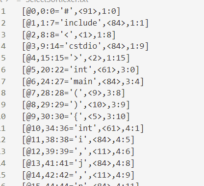
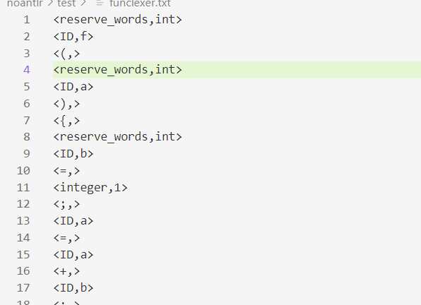

# 编译原理大作业：C++到LLVM的编译器-词法分析部分
小组成员：林欣涛，杜家锟，朱思漠

## 使用说明
### 1. 环境配置
系统：Windows 10
语言：Python 3.9
安装 ANTLR4: https://zhuanlan.zhihu.com/p/423928097
安装 Python 依赖库: pip install -r requirements.txt
### 2. 编译与运行
- 采用antlr工具
由 ANTLR 指令根据g4生成对应代码文件: make antlr（或者直接使用make）
运行程序: python main.py <inputfilename> 
简单实例: python main.py test\SelectSort.cpp
##

- 不采用antlr工具
使用方法：`python3 LexerDemo.py <inputfilename> <outputfilename>`
在outputfile中可以看到输出的token二元组
简单实例：python LexerDemo.py  !!!!还没写完

### 3. 测试
- 采用antlr工具
目前在test文件夹下，我们实现了大作业要求样例的回文测例和排序测例，直接点击运行test.py 可以对所有的样例进行词法分析操作，并将每一个测例经过词法分析后的token输出到测例文件名+lexer.txt的文件中，从这些txt中的内容可以判断词法分析程序是否正确。清除生成的txt文件可以使用make cleantxt指令。
- 不采用antlr工具
使用方法：`python3 LexerDemo.py <inputfilename> <outputfilename>`
## 难点
- 在使用antlr工具的情况下，g4文件的编写较为繁琐，极其容易产生遗漏。
- antlr工具的jar包与python的相关SDK依赖库`antlr4-python3-runtime`的版本之间存在一定关系，可能因为版本不兼容的原因而出现环境方面的问题。
- 在不使用antlr等工具的情况下，随着支持的词法增多，相应的自动机也越来越复杂，出现bug的概率也随之增大，编写起来也更加困难。
## 创新点
完成了采用/不采用antlr工具两种方式的词法分析
## 小组分工
林欣涛：antlr4工具实现词法分析
杜家锟：不使用已有工具实现简单的词法分析
朱思漠：文档撰写