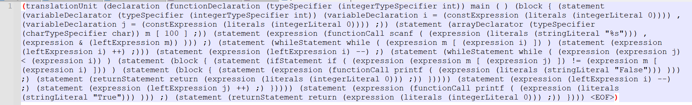

## 语法分析部分报告

## 使用说明
### 1 环境配置照旧
### 2 编译和运行
使用antlr工具
- 文件记录语法分析结果：
有ANTLR指令根据g4生成对应的代码文件: make antlr（或者直接使用make）
运行程序: python main.py <inputfilename>
简单实例: python main.py test\SelectSort.cpp
运行后将会在test文件夹创建对应的txt文件来存储输出结果，如下图：


- 图片显示语法分析结果：
先进入grammar文件夹：cd .\grammar\
用 ANTLR指令根据g4生成对应的代码文件： 
```bash
// 按照顺序输入如下指令
antlr4 .\cpp14Lexer.g4 .\cpp14Parser.g4
javac cpp14*.java
```
运行程序：cat <inputfilename> | grun cpp14 translationUnit -gui
简单实例：cat .\palindrome.cpp | grun cpp14 translationUnit -gui
运行后将会有java程序弹出绘图结果的窗口，如下图：


### 3. 测试
- 采用antlr工具-文件记录语法分析结果
目前在test文件夹下，我们实现了大作业要求样例的回文测例和排序测例，直接点击运行test.py 可以对所有的样例进行词法分析+语法分析操作，并将每一个测例经过词法分析+语法分析后的tree的字符串结构输出到测例文件名+parser.txt的文件中，从这些txt中的内容可以判断词法分析和语法程序是否正确。清除生成的txt文件可以使用make cleantxt指令。
